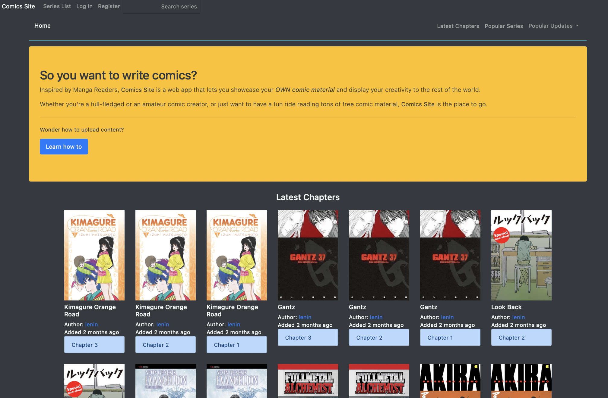
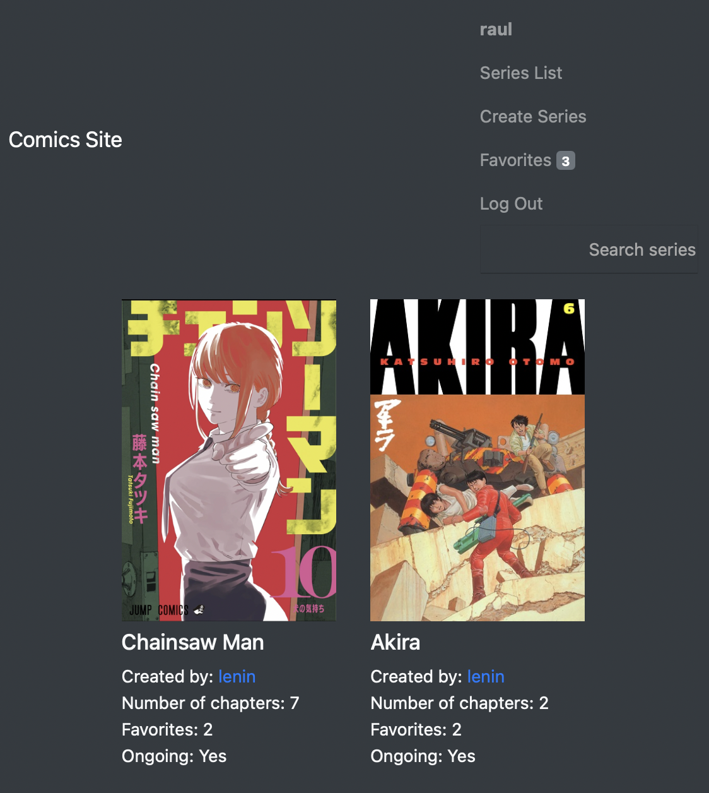
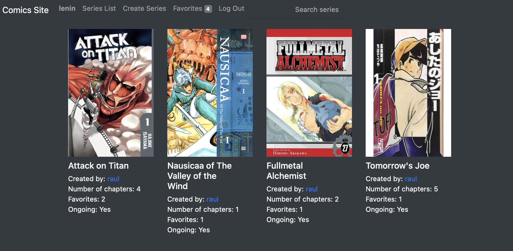
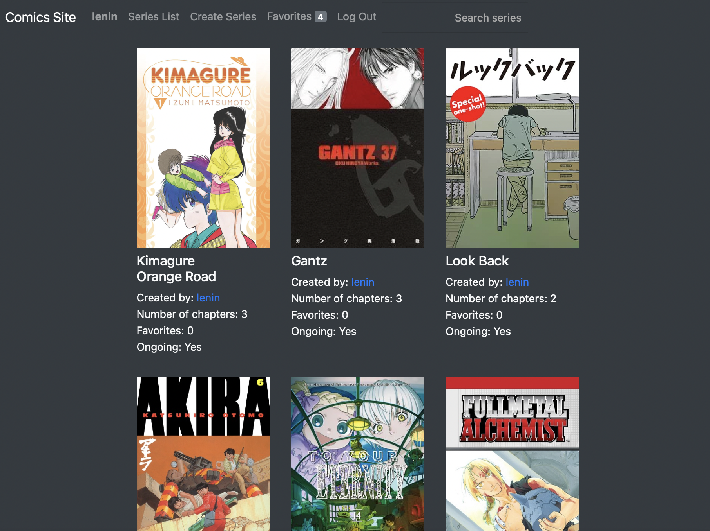
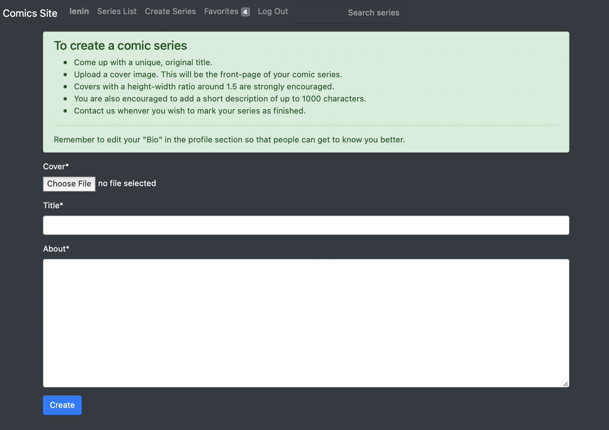
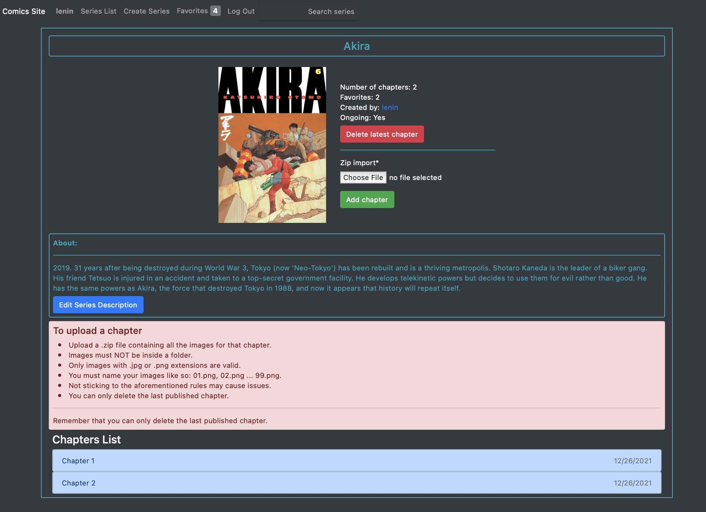
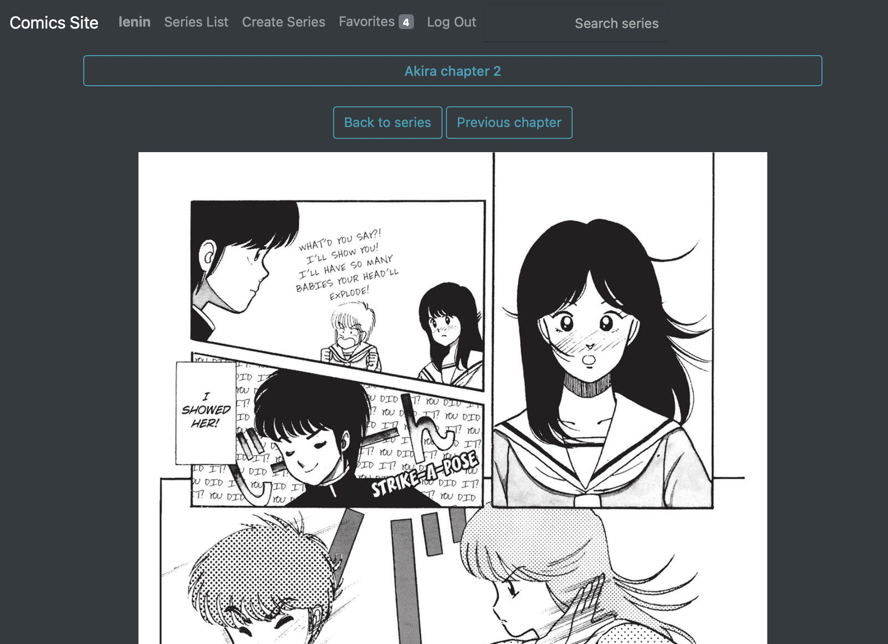

# `Comics Site`

``Comics Site`` is a responsive web app built on the `Django Framework` as part of the `Capstone Project from the CS50's Web Development with Python and Javascript` course.

This README follows the guidelines laid down by the project instructions, save for the screenshots and Gifs.

Comics-site allows the user to read, create and follow original comics series.


### **Screenshots:** 

<table>
  <tr>
    <td></td>
    <td></td>
  </tr>
  <tr>
    <td></td>
    <td></td>
  </tr>
  <tr>
    <td></td>
    <td></td>
  </tr>
  <tr>
    <td></td>
    <td></td>
  </tr>
 </table>

### **Distinctiveness and Complexity:** 

- `Comics Site` was inspired by Manga Reader sites. The key difference is that it is not only for reading but also **for creating comics material**. Only the user that created a series can upload chapters to that series and, as a consequence, the entirety of the comics content hosted in `Comics Site` is original (or should be, given that no one plagiarizes a chapter/series from someone or somewhere else).

- Comis Site makes use of Python on both the back and the front end thanks to Django. JavaScript is also used on the front end, allowing the main page to act as a single-page web app, as well as making it possible for the profile and series detail sections to display a functional "edit" button.

- `Comics Site` also deals with the storage of files uploaded through a web app on the hard drive.

### **Features:**

- **Register, Log in, Log out:** self-explanatory.

- **Main Page:** clicking on `"Comics Site"` will take the user to the main index page which is divided itself into three sections: 

    - **Latest Chapters:** shows the latest published chapters. On scroll, shows 9 more and so on (makes use of JS).

    - **Popular Series:** shows the most favorite series. On scroll, shows 9 more and so on (makes use of JS).

    - **Popular Updates:** shows the chapters with the most views in a range of 1, 2 and 7 days (makes use of JS).

    Clicking on the cover images or the chapter number will take the user to the series detail page and chapter respectively (makes use of JS).

- **Series List:** self explanatory. Clicking on the cover images will take the user to the series detail page.

- **Create Series:** allows registered users to create a new series. This section also shows the guidelines to do so.

- **Series detail:** shows details about the series, such as number of chapters, author, status, number of favorites and synopsis. This section also displays the entire list of chapters along with the dates they were released on, and allows the user to add it to (or remove from) his favorites series list. If the user visiting the series page is its author, it won't allow it to add it to its favorites but it will allow the user to upload a new chapter, remove the last published chapter and edit the series' synopsis (this last part makes use of JS). This section will also show the author the guidelines to upload a new chapter. Once a chapter is uploaded, the author will be taken to that chapter and a dismissible success banner will be displayed. If there's an issue with the upload due to one or many pages not abiding to the guidelines, a dismissible error message banner will show up.

- **Chapter Page:** displays the chapter's pages in a long-strip format. Buttons to go back and forth across chapters are also implemented and will appear depending on whether there is a previous/next chapter. A button to go back to the series detail page is also there.

- **Favorites:** shows the registered user a list of its favorite series. Clicking on a cover image will take the user to that series' detail page. A label displaying the number of favorite series is shown next to the "Favorites" nav link.

- **User Profile:** clicking on any user will take you his profile page where a list of the series authored by that user will be shown, as well as a short bio about that user. If you are visiting your own profile, you will also be able to edit your bio. (makes use of JS).

- **Search series:** displays a list of all the series containing the search input as substring.

### How to Run: 

```
python3 makemigrations
python3 migrate
python3 manage.py runserver
```

### Created Files:

- **index.js:** JS code behind the main page.
- **profile.js:** JS code behind the "edit bio" section of the profile page.
- **series_detail.js:** JS code behind the "edit about" section of the series detail page.
- **styles.css:** small style attributes.
- **chapter.html:** the page that is displayed when reading a chapter.
create_series.html: the page that is displayed when creating a new series. 
- **Index.html:** the main page. Contains its own nav bar. It also contains three main sections (Latest Chapters, Popular Series and Popular Updates) which are displayed mainly trough JS.
- **layout.html:** self-explanatory.
- **login.html:** self-explanatory.
- **profile.html:** the page that is displayed whenever visiting a user's profile.
- **register.html:** self-explanatory.
- **series_detail.html:** the page that is displayed whenever a user clicks the cover image of any series.
- **series_list.html:** self-explanatory. This page is also displayed when visiting the favorites section and searching for a series as it is only the filter associated in the views.py file that changes the series list output.
- **uploads/media:** the path to where all the chapters' images and series' covers are uploaded.

### Models: 

- **User:** same as usual but with a "bio" field.
- **Series:** self-explanatory.
- **Chapter:** model for all the series' chapters. The combination of the series and chapter fields must be unique. The file field must be a .zip file containing the pages of any given chapter. Three methods are implemented to check if the chapter file is valid and to deal with the success-error scenarios, after which the original .zip file is removed to free up disk space.
- **GalleryImage:** if a chapter upload is valid, its pages will 
be uploaded to the "upload/media" path. This the one model called in order to display the actual chapter so that users can read it.

### Additional information:

- Users created:
    - Superuser: heredia
    - Users: raul
    - passwords: 1234

- A chapter must be uploaded through a .zip file containing its pages in .jpg or .png format. Pages shall be named like so: 01.png, 02.png ... 99.png. These guidelines are also shown in the main page.

- The series and pages displayed are random. No copyright infringement intended.

- Nice things that can be implemented from this point onwards: a comments section, image and .zip files size restrictions, non-only integer chapter numeration, featured authors section and so on.

- [Watch full demonstration on YouTube](https://www.youtube.com/watch?v=By3QP9AFunA)